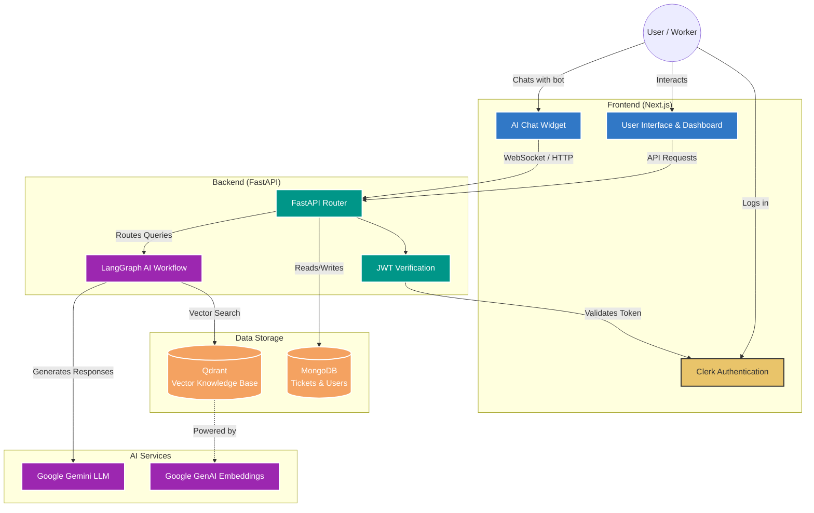

# DigiPlus AI-Powered Service Desk

Welcome to the **DigiPlus AI-Powered Service Desk**, a modern, intelligent IT support platform designed to streamline issue resolution. This application leverages advanced AI agents, vector-based knowledge retrieval, and a seamless full-stack architecture to provide automated IT assistance, ticket routing, and a dedicated worker dashboard for specific IT departments.

---

## 🏗️ Architecture

Below is the high-level architecture diagram of the DigiPlus Service Desk:

---

## 💻 Tech Stack & Usage

### Frontend
* **Next.js 16 (App Router)**: Powers the entire frontend application, providing server-side rendering, secure server actions, and dynamic routing for both user and worker dashboards.
* **Clerk**: Handles all user authentication, session management, and role-based access control (RBAC), ensuring that only authorized IT staff can access department-specific queues.
* **Tailwind CSS & Framer Motion**: Provides a highly responsive, modern, dark-themed user interface with fluid animations and glassmorphism design aesthetics.

### Backend
* **FastAPI**: Serves as the core, asynchronous Python backend framework, providing high-performance RESTful APIs to handle ticket creation, chat streams, and data retrieval.
* **MongoDB (Motor)**: Acts as the primary NoSQL database, storing ticket metadata, status updates, user associations, and department assignments in a flexible, scalable format.
* **Qdrant**: A high-performance vector database used to store and retrieve IT troubleshooting FAQs and knowledge base articles via semantic similarity search.

### AI & Agents
* **Google Gemini (gemini-1.5-flash)**: The primary Large Language Model that powers the IT Support Chatbot, enabling intelligent conversation, issue analysis, and automated responses.
* **Google Generative AI Embeddings**: Converts text from the IT knowledge base into high-dimensional vectors, allowing the Qdrant database to perform accurate semantic searches for relevant solutions.
* **LangChain & LangGraph**: Orchestrates the multi-agent workflow, managing the state between the conversational agent, the vector retriever, and the ticket-routing logic seamlessly.

---

## 🔄 Workflow & Logic

### 👥 User Roles & Dashboards
The platform distinguishes between two primary types of users using Clerk's Role-Based Access Control (RBAC):
1. **Standard Users**: Have access to the main IT Support Chatbot and their personal "Your Tickets" dashboard. They can chat to resolve issues, view the status of their raised tickets, and track progress.
2. **Department Workers**: IT staff assigned to specific departments (e.g., Network, Identity, Endpoint). They have access to a dedicated Department Dashboard where they only see tickets routed to their specific domain.

### 🤖 Chatbot & Resolution Logic
The AI chatbot follows a multi-tiered approach to resolve user queries efficiently before escalating to human workers:
1. **Local FAQs (Tier 1)**: The agent first checks a hardcoded list of common, high-priority issues (e.g., "Forgot Password", "VPN connection issues"). If a match is found, it provides an immediate, predefined solution.
2. **Vector DB Similarity (Tier 2)**: If the query is not in the quick FAQs, the agent converts the user's message into vector embeddings and queries the **Qdrant Vector Database**. It uses a similarity score threshold to find relevant IT knowledge base articles. If a high-confidence match is found, the solution is streamed back to the user.
3. **Ticket Escalation (Tier 3)**: If neither the FAQs nor the Vector DB yields a confident solution, the chatbot gracefully admits it doesn't have the answer and provides a **"Raise Ticket"** suggestion button.
4. **Intelligent Routing**: When the user clicks the "Raise Ticket" button, the AI analyzes the context of the conversation, categorizes the issue (e.g., Network, Identity, Business Apps), and automatically routes the new ticket to the correct department's queue.

### 🎫 Jira Integration & Ticket Acceptance
When an issue is escalated to a department queue, the IT workers take over:
1. **Review**: A worker views the ticket details (which include the AI's preliminary analysis and priority score) on their department dashboard.
2. **Acceptance**: The worker clicks the **"Accept"** button on the ticket.
3. **Jira Synchronization**: The backend intercepts this action and automatically triggers the Jira Integration API. A corresponding issue is created in the corporate Jira workspace, enabling the IT team to track their work in their native project management tool.
4. **Status Update**: The ticket status in MongoDB is updated from `pending_analysis` to `open`, and the user's personal dashboard reflects this progress in real-time.
